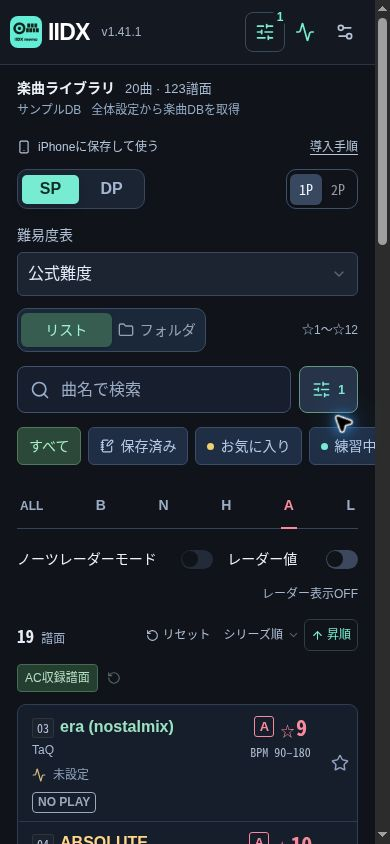
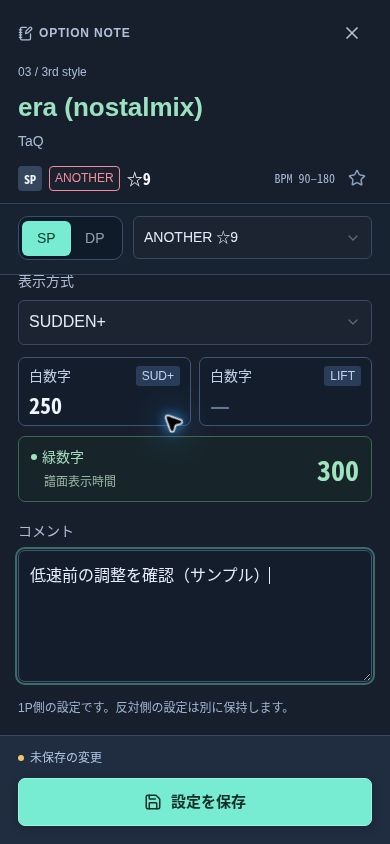
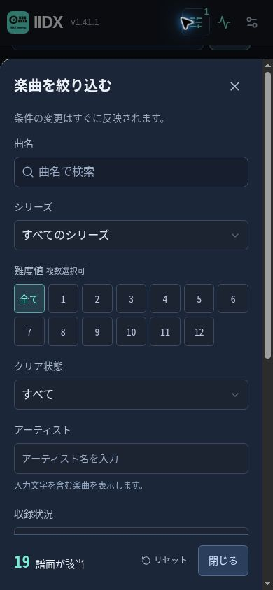

# IIDX memo

iPhoneのホーム画面でも使えるIIDXの譜面別メモ。SP/DPのオプション、白数字、緑数字、コメント、プレー記録などは利用者の端末に保存します。

## 利用について

このアプリは、作者が自分で使うために趣味で開発・公開している個人用アプリです。利用を希望する方は、以下を了承のうえ、自己責任でご利用ください。

- 不具合や未完成の機能が残っている可能性があります。動作の正確性・安定性や、保存データの保持を保証するものではありません。
- 本アプリの利用により発生したトラブル、データの消失・破損、その他の損害について、法令上認められる範囲で作者は責任を負いません。
- 不具合の修正・機能追加・更新は、作者の気分・都合・余裕に応じて行います。報告や要望への対応、修正時期、継続的なサポートはお約束できません。
- 大切なメモ・設定・プレー記録は、利用者自身で定期的にバックアップしてください。

## 画面イメージ

スマートフォン幅で表示したサンプル画面です。曲名・譜面情報はサンプルDBを使用し、個人のプレー記録は含めていません。

| 楽曲一覧 | オプションメモ | 絞り込み |
| :---: | :---: | :---: |
|  |  |  |

## 最新バージョン

**v1.42.11**（2026年10月6日 10:37 JST 更新・ChatGPT側の記録上の更新82回）

更新回数は、初回作成を除くChatGPT側のソース更新履歴を基準に数えます。Site版・GitHub版への同じ変更の反映は1回とし、端末ごとの更新回数は数えません。

## 更新履歴

日時は日本時間です。GitHub上で公開した版を記載しています。

- **v1.42.11 — 2026年10月6日 10:37**：スコアグラフのMAX文字の影を背面に描画する方式へ変更。バー内・バー上の虹色文字を潰さず、他の判定文字と同様に影を保持。「このアプリについて」のバージョン横にChatGPT側の更新回数、下に更新日時を追加。
- **v1.42.10 — 2026年10月6日 10:28**：スコアグラフのMAX文字に重なる黒い影を除去。バー内の判定基準表示・バー上の判定表示で虹色の文字が潰れる問題を修正。
- **v1.42.9 — 2026年10月6日 09:00**：BEMANIWikiを定期取得したIIDX34 JSONの取り込みに対応。全体設定に公開URLの選択ボタン・元データ更新日時を追加。掲載曲の確認済み譜面を補完し、予定曲・存在未確認譜面・未確定の譜面要素を除外。別途取り込んだレーダー、目視確認JSON、メモ・スコア・曲ID対応を保持。曲名・アーティストが一致しない曲は照合保留。
- **v1.42.8 — 2026年10月5日 21:40**：スコア取得ツールの「結果をコピー」を取得結果の先頭へ移動し、取得完了時にボタンを表示。コピー完了をボタン付近に表示し、自動コピーが使えない場合は代替コピー・手動選択に対応。取得ツールはv1.24.2。登録済みブックマークのURLは新しい取得コードへの置き換えが必要。
- **v1.42.7 — 2026年9月30日 01:07**：SPのアシスト項目を譜面配置ドロップダウンの左端に整列。DPのFLIPと左右ランダム連動を横並びに配置。SPの白数字もSUD+・LIFTを別ボックス化。数値欄の補足名をタイトル右、「共通」を数値右へ配置し、「譜面表示時間」を「表示時間」に短縮。
- **v1.42.6 — 2026年9月30日 00:37**：曲編集の譜面配置・表示方式をコンパクトに整理。SPは白数字グループと緑数字を2列、DPはSUD+・LIFT・緑数字を3列表示。DPコメントを左右共通化し、旧コメントは両側の内容を引き継ぎ。コメント欄は内容に合わせて2〜6行で自動伸縮。
- **v1.42.5 — 2026年9月30日 00:12**：iPhoneのホーム画面版で、曲編集の上部をメイン画面と同じ位置調整に統一。ソフラン曲の説明文を削除し、BPMの左にコンパクトに表示。
- **v1.42.4 — 2026年9月29日 23:39**：曲編集のオプション欄を先頭に移動。スコア・プレイ履歴、レーダー・難易度、譜面情報・手入力は下部で折りたたみ表示。開閉状態を端末に保存し、曲切替・再起動・バックアップで引き継ぎ。
- **v1.42.3 — 2026年9月29日 22:45**：スコアグラフにB判定線を追加。MAXは虹色、AAAは金、AAは銀、Aは薄緑、B以下は水色で目盛とバー上の判定を表示。各バーの上部に最も近い判定基準との差を表示。Site版にも反映。
- **v1.42.2 — 2026年9月28日 22:28**：楽曲JSONの5桁の曲IDから先頭2桁を初出シリーズとして読み取り、シリーズ不明の曲と保存済みデータを補正。通常DBで判定済みのシリーズは保持。シリーズ名表示にも反映し、Site版にも適用。
- **v1.42.1 — 2026年9月28日 12:21**：レーダーの再描画と難易度切り替えの連動を改善。タイトルバーに難易度を順送りするボタンを追加。切り替え時に一覧の表示件数・閲覧位置を保持。Site版にも反映。
- **v1.42.0 — 2026年9月28日 11:41**：スコアグラフモードを追加。シリーズ別EXスコアを縦棒で比較し、選択した記録の詳細を表示。全体設定に今作・過去作の色設定を追加し、保存・バックアップに対応。Site版にも反映。
- **v1.41.2 — 2026年9月28日 10:52**：曲編集画面の固定ペインの余白を縮小。曲名・アーティスト名の文字サイズを維持し、編集領域を拡大。READMEのデータ説明を整理し、スマートフォン幅の画面例3枚を追加。Site版にも反映。
- **v1.41.1 — 2026年9月28日 02:57**：IIDX21〜26の旧公式CSVに対応。LEGGENDARIA列がない場合、末尾「†LEGGENDARIA」「†」の別曲レコードのANOTHERをLEGGENDARIAへ割り当て。通常曲との回数は合算、最終日時は最新を採用。曲名途中の†・現行CSVは維持。BEGINNER列なし・旧EXスコア列名にも対応。旧形式のLEGGENDARIA記録とプレー回数の保持を確認。Site版にも反映。
- **v1.41.0 — 2026年9月28日 02:11**：公式プレイデータCSVのファイル取り込みに対応。最終レコードの作品名から保存先シリーズを判定（修正可能）、曲名・別名で照合。PGREAT・GREAT・MISS、曲単位のSP/DP別プレー回数・最終プレー日時をシリーズ別に保存。歴代最小MISSと保存シリーズ合計回数を表示し、再取り込み・バックアップ・曲ID移行にも対応。Site版にも反映。
- **v1.40.0 — 2026年9月28日 01:14**：取り込み楽曲データを最優先に固定し、曲ID対応・別名を保存。確認済み2434組の対応表を同梱し、既存の重複曲を統合。非公式難易度・CPI、旧表記での検索とスコア照合を維持。メモ・お気に入り・手入力・スコア履歴を移行し、競合分は旧IDでバックアップに保持。曲ID対応表は通常バックアップにも保存。Site版にも反映。
- **v1.39.9 — 2026年9月28日 00:27**：レーダー値のみ表示で項目名と数値が2段になる問題を修正。各項目を1行に戻し、幅に応じて2〜3列で表示。★の改行防止・小数第2位の桁揃えは維持。Site版にも反映。
- **v1.39.8 — 2026年9月28日 00:12**：曲リストのシリーズ番号を曲名左側へ移動し、曲名カラー・輪郭と独立した表示に変更。レーダー値は小数第2位の位置をそろえ、★用の固定幅を確保して改行を防止。コンパクト表示は項目名と数値を上下2段に統一。Site版にも反映。
- **v1.39.7 — 2026年9月27日 23:54**：曲側・マイノーツレーダーの塗りつぶしと枠線を、最大値の項目の文字色に連動。従来の透明度・線幅を維持し、ライトテーマにも対応。同値最大はNOTES→PEAK→SCRATCH→SOF-LAN→CHARGE→CHORDの順で採用。Site版にも反映。
- **v1.39.6 — 2026年9月27日 17:37**：全体設定に「曲リストに取得元を表示」を追加（初期OFF、設定保存・バックアップ対象）。ON時は曲名の取得元・ファイル名・内部IDを曲リストに表示。DB更新・JSON取り込み時に曲ごとの取得元を記録し、旧データの不明点は推定・未記録と表示。Site版にも反映。
- **v1.39.5 — 2026年9月27日 17:09**：iPhoneのホーム画面アプリの縦表示で、タイトル上端にかかるぼかしを避けるため20pxの余白を追加。通常の更新で適用でき、メモ・設定の移行やアプリの再追加は不要。Site版にも反映。iPhone実機での改善確認は継続中。
- **v1.39.4 — 2026年9月27日 16:54**：GitHub Pages版のタイトルロゴの参照先を修正。楽曲ライブラリの曲数・譜面数・端末内DB・取得日をコンパクトに統合。タイトルバーに絞り込みボタンを追加し、絞り込み画面にもメイン画面と連動する曲名検索を追加。iPhone上部を不透明な固定表示に変更し、ホーム画面アプリのステータスバーを非透過に変更（iPhone固有のぼかしは実機確認が必要）。Site版にも同じUIを反映。
- **v1.39.3 — 2026年9月27日 16:19**：シリーズ別カラー・輪郭（ダーク／ライト両方）、テーマ、検索・絞り込み・並び順、難易度表、レーダー、スコア表示設定をバックアップ・復元の対象に追加。旧形式の復元時は移行先の表示設定を保持。保存失敗時の設定復旧と移行テストを追加。Site版も同じ修正を適用。
- **v1.39.2 — 2026年9月26日 03:22**：iidx info exporterのJSONに含まれる譜面別のAC収録・未収録・不明を取り込み、収録状況フィルターに反映。曲一覧の収録状況表示が途中で改行されないよう調整。取り込みの確認テストを追加。
- **v1.39.0 — 2026年9月26日 03:11**：GitHub Pages版を初公開。iPhoneのホーム画面への追加、アプリ内の更新確認、オフライン利用に対応。

## 開く・更新する

GitHub Pages: https://masa-6cha.github.io/IIDX-memo/

Safariで開いて「ホーム画面に追加」すると、アプリとして使用できます。全体設定の「アプリの更新を確認」から公開済みの新バージョンを取り込み、「新しいアプリに切り替える」で適用します。更新には通信が必要です。楽曲DBの更新はアプリ本体の更新とは別です。

## 旧サイトから移行する場合

旧サイトの端末内データはURLが異なるため自動で移行しません。

1. 移行元と移行先をv1.39.3以降に更新し、旧アプリの全体設定でテキストバックアップを作成し、安全な場所に保管する。
2. 新しいGitHub PagesのURLをSafariで開く。
3. 新アプリの全体設定からバックアップを取り込む。
4. 曲リスト、メモ、お気に入り、プレー記録、カラー・表示設定を確認してからホーム画面に追加する。

**v1.39.2以前に作成したバックアップには、カラー・表示・絞り込み設定が含まれません。移行元を更新してバックアップを作り直してください。** 旧形式のバックアップを取り込んだ場合、これらの設定は移行先の現在の値を保持します。

手動で取り込んだ楽曲JSONは通常のメモ・スコアのバックアップに含まれません。元のJSONファイルまたはURLを保管し、新アプリでも取り込んでください。移行確認までは旧アプリを残してください。

## 開発

Node.js 24とpnpm 11.25.0を使用します。

```sh
pnpm install --frozen-lockfile
pnpm run test:pages
pnpm run build
```

GitHub Actionsが`main`への反映後に`pages-dist/`をGitHub Pagesへ公開します。リポジトリの **Settings → Pages → Build and deployment → Source** は **GitHub Actions** を選択してください。サービスワーカーの配布範囲は `/IIDX-memo/` です。

## 曲名・取り込みデータの優先順位（v1.40.0以降）

楽曲JSONに含まれる曲名・アーティスト・譜面情報を最優先にし、通常DBの更新順に依存させません。楽曲JSON側の未指定項目は既存値を保持します。難度のnullは既存値、それ以外の明示nullは未取得として扱う従来仕様を維持します。非公式難易度・CPIは通常DBの曲ID＋SP/DP＋譜面種別で取得します。

- アプリ更新時、保存済みDBの重複を対応が確定した範囲で自動統合します。曲名とアーティストの正規化一致、確認済み別名、保存したID対応を利用します。旧譜面などの曖昧な候補は統合しません。
- 表示は楽曲JSON側の曲名を使い、通常DB・以前に取り込んだ表記を別名として保持します。検索・スコア取り込みは別名にも対応します。
- メモ・お気に入り・手入力・スコア履歴は統合先へ移します。同じ譜面・同じ側／シリーズに異なる値があれば上書きせず、旧IDの記録をバックアップ内に保持して通知します。
- 対応表・ID移行先は通常のテキストバックアップに含まれます。楽曲DB本体・楽曲JSON・別名一覧は従来どおり元JSONから再取得します。
- 通常の更新は、アプリ更新後に楽曲DBと楽曲JSONを更新するだけです。どちらを先に更新しても保存した対応を利用します。

### GitHubで曲ID対応表を管理する

[`lib/song-identities.json`](lib/song-identities.json) に確認済みの1対1対応を記録しています。楽曲JSONそのものを手修正する必要はありません。対応を増やしたら、全体設定 → 楽曲JSONの取り込み →「曲ID対応表のURLを使用」→ 読み込み・取り込みで反映できます。照合保留だった曲は、その後に楽曲JSONを再取り込みしてください。対応表は次回アプリ更新にも同梱されます。

```json
{
  "schema": "iidx-song-identities/1",
  "links": [
    { "music_id": 19071, "song_key": "iidx-data-table:1964" }
  ]
}
```

これはquaver♪の実際の対応例です。楽曲JSONのmusic_idと通常DBの番号は別体系です。同じ曲と確認できたものだけ登録してください。既存対応の付け替え・1対多の対応は誤統合防止のため拒否します。対応待ち・照合保留は全体設定、曲ごとの別名・通常DB IDは「曲リストに取得元を表示」で確認できます。

## BEMANIWikiのIIDX34 JSON（v1.42.9以降）

全体設定 → 楽曲JSONの取り込み → GitHub → 「BEMANIWiki IIDX34のURLを使用」→「URLから読み込む」→ 内容を確認して取り込みます。

対象URL： https://raw.githubusercontent.com/MASA-6cha/iidx-song-data/main/data/bemaniwiki-iidx34.json

- 曲名・アーティスト・ジャンル・BPM・公式難度・ノーツ数・確定したCN/HCN/BSS/MSSを、不足分へ反映します。別途取り込んだ楽曲JSON・通常DBの既存値を優先します。
- 掲載済みの曲で `exists: true` の譜面だけを取り込み、AC収録（#34基準）として扱います。`planned` の予定曲、存在未確認の譜面、「CN?」などの未確定フラグは確定値にしません。
- このJSONにはレーダーがありません。既存のレーダー値を消さず、楽曲JSON・通常DB・目視確認JSON・アプリ内手入力の値を引き続き利用します。目視確認JSONとは別に保存します。
- 曲IDが未設定のため、曲名・アーティスト・保存済みの別名で一意に照合します。一致しない曲・候補が複数ある曲は照合保留。新規曲は専用の内部IDで管理し、後日通常DBと一致した際はメモ・スコアなどを引き継ぎます。
- GitHub側の定期クロールと端末への取り込みは別です。同じURLを再読み込みして取り込むと最新の公開データを反映します。元データ更新日時と端末への取り込み日時を全体設定に表示します。

## 公式プレイデータCSV（v1.41.0以降）

全体設定 → 公式スコアの取得・取り込み → 「公式プレイデータCSV」でファイルを選び、SP/DP・保存先・対応先を確認して保存します。UTF-8とShift_JISに対応します。

- ファイル名の `_sp_score.csv` / `_dp_score.csv` からモードを判定します。不明な場合は選択してください。
- 最終レコードの「バージョン」を保存先とみなします（例：EPOLIS → #31）。各行のバージョンは曲の初出作品で、保存先ではありません。並べ替え・抜粋したCSVや未知の作品名の場合は、保存先番号を修正してください。
- 曲名は取り込み楽曲データを優先したDBの曲名・保存済み別名で照合します。難度違い・複数候補は自動保存せず、対応先を確認します。
- PGREAT・GREAT・ミスカウントは譜面別、プレー回数・最終プレー日時は曲・SP/DP別で保存します。詳細画面のシリーズ別履歴で確認できます。日時は日本時間です。
- 歴代表示のPGREAT・GREATは最高EXの記録、MISSは最小値です。回数は既知の保存シリーズを一度ずつ合計します。同一シリーズの再取り込みは置き換えです。既知シリーズがない場合のみシリーズ不明の回数を使います。
- CSVと記録は端末内で処理・保存します。利用者のCSVをGitHubやSiteの公開ファイルに含めません。

### IIDX21〜26の旧CSV

LEGGENDARIA列がない旧公式CSVでは、曲名末尾の「†LEGGENDARIA」または単体の「†」を外して通常曲と照合し、その行のANOTHER記録をLEGGENDARIAへ保存します。通常行と別行のプレー回数は合算し、最終プレー日時は新しい方を使います。行順には依存しません。BEGINNER列がない場合はスキップします。曲名途中の「†」は変更しません。IIDX27以降の列形式にはこの変換を適用しません。

## スコアグラフ（v1.42.0以降）

曲リストの「スコアグラフ」で、保存済みのシリーズ別EXスコアを比較できます。今作（端末内に保存された最新シリーズ）は初期設定で青、過去作・シリーズ不明は共通色です。全体設定 →「スコアグラフの色」からそれぞれ変更できます。表示モードと色は端末に保存し、テキストバックアップでも引き継ぎます。

- 棒をタップすると、そのシリーズのEXスコア・DJ LEVEL・スコア率・MISS COUNTを表示します。曲名をタップすると曲編集画面を開きます。
- 5シリーズずつ表示し、「以前のシリーズ」「新しいシリーズ」で切り替えます。記録のないシリーズは「—」とし、0点には置き換えません。
- 同じ譜面のノーツ数×2をMAXとしてB・A・AA・AAAの基準線を表示します。各棒のEXスコアに判定を併記し、棒の上部に最も近い判定基準との差を表示します。ノーツ数未取得時は保存スコアの最大値を表示上限とし、ランク基準線・スコア率は表示しません。ノーツ数と不一致の値は棒を表示せず、記録の確認を案内します。
- 「過去最高比」は今作と過去の既知シリーズの最高EXとの差です。シリーズ不明の記録は時系列が不明のため、この差分には含めません。スコアグラフは「スコアの表示対象」の選択にかかわらず、保存済みシリーズを比較します。
